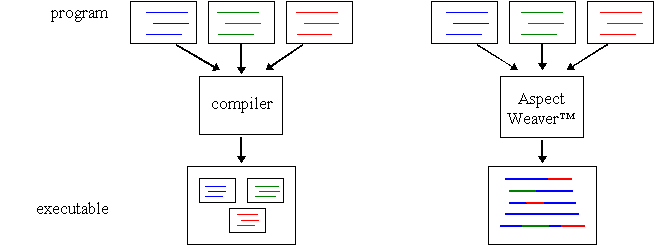

# aspect-AOP-exercise

## Motivación

Revisando el paradigma de programación **"Programación Orientada a Aspectos o AOP"** (aspect-oriented programming) visualizo varias posibilidades de implementación dentro de un framework que permita la ejecución de pruebas automatizadas.

Y para ello requiero realizar el ejercicio de ejecución de aspectos de una forma sencilla y así confirmar si es factible su implementación e identificar nuevos casos de implantación.

El punto principal de la AOP es la separación de las funcionalidades dentro de un sistema y debemos considerar:

* Por un lado tenemos las funcionalidades comunes utilizadas a lo largo del sistema y por otro lado, las funcionalidades propias de cada modelo.

## Ejercicios

Al momento de realizar este ejercicio encontre dos configuraciones para implementar los aspectos y se codificaron de la siguiente forma:

### Branchs

* [compile-weaving](https://github.com/isortegahlabs/aspect-AOP-exercise/tree/feature/compile-weaving): Contiene la 
configuración necesaria para realizar la ejecución de los aspectos utilizando el plugin **aspectj-maven-plugin** 
durante la fase **compile**.     

* [loadtime-weaving](https://github.com/isortegahlabs/aspect-AOP-exercise/tree/feature/loadtime-weaving): En esta rama 
se presenta la configuración requerida para la ejecución de la funcionalidad de los aspectos durante la ejecución del 
plugin **exec-maven-plugin**.  

En ambos ejercicios se puede generar un jar ejecutable con dependencias.

### Documentación de Referencia

* [Aspect Oriented Programming – AspectJ](https://folderit.net/es/blog/aspect-oriented-programming-aspectj-es/)  
* [Understanding AOP and AspectJ](https://livebook.manning.com/book/aspectj-in-action-second-edition/part-1)  
* [Introduction to Pointcut Expressions in Spring](https://www.baeldung.com/spring-aop-pointcut-tutorial)  
* [Programación Orientada a Aspectos](http://www.exa.unicen.edu.ar/catedras/deaspect/aspectj.pdf)